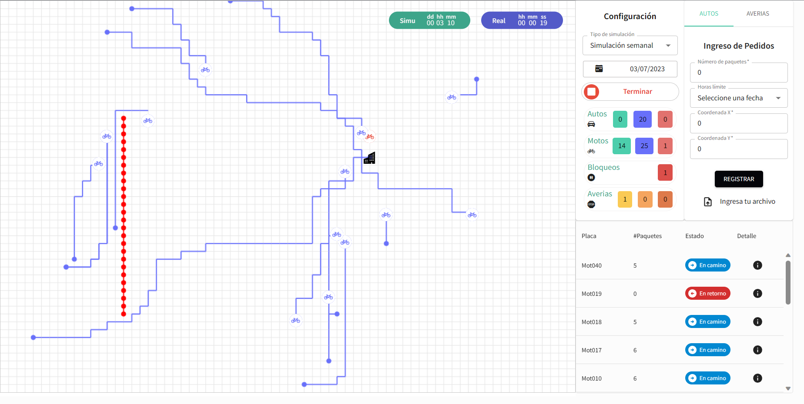

TrackerHub Project
-----------------------

TrackerHub is a robust and efficient Package Delivery System built using React and TypeScript. It incorporates a real-time vehicle tracking feature, leveraging an optimized navigation system powered by the A* algorithm that was designed in the backend with Springboot. &nbsp;

This repository contains the frontend implementation of the system, which encompasses the necessary object types for consuming and displaying the shared data from the backend. It establishes a clear structure for how the data is consumed and rendered using HTML and CSS styles. The use of TypeScript ensures type safety and enhances code robustness, allowing for better error detection and prevention during development. &nbsp;

By utilizing React, TrackerHub offers a responsive and interactive user interface, providing a seamless experience for users interacting with the package delivery system. The A* algorithm efficiently calculates the most optimal routes for vehicles, ensuring efficient delivery routes and minimizing delivery time. &nbsp;

To run it, clone the project, do "npm install" and execute "npm run dev". &nbsp;

This project was developed thanks to: &nbsp;

Iván Córdova -> Frontend Engineer &nbsp;
Oscar Navarro -> Frontend Engineer &nbsp;
Carlos Toro -> Backend Engineer &nbsp;
Jherson Zuñiga -> Documentator &nbsp;

(*) All the commits are in the organization-private repository.&nbsp;
